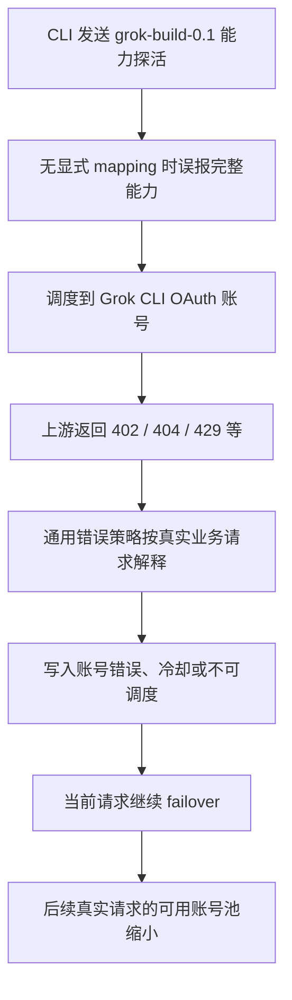
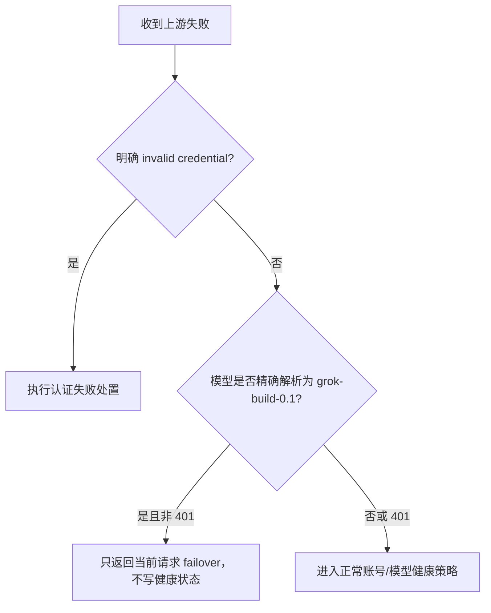

# Grok Build 噪音探活污染账号健康状态事故复盘

日期：2026-07-22

影响版本：`v0.1.279` 及更早版本；`v0.1.280` 完成第一阶段止血；`v0.1.281` 完成全路径隔离

涉及平台：Grok OAuth / `cli-chat-proxy.grok.com`

## 1. 摘要

部分 Grok CLI 会发送 `grok-build-0.1` 作为可选能力探测。该模型已经不在 xAI 官方 Grok CLI 的默认模型目录中；它失败不代表 OAuth 凭据、订阅或真实推理模型不可用。

旧实现存在两类叠加问题：

1. 未配置账号模型映射时，系统曾把 Grok CLI 账号视为支持完整 Grok 模型集合，使 `grok-build-0.1` 探活进入真实账号调度。
2. 上游返回的 402、403、429 等错误被通用健康策略解释为账号欠费、权限失效或限流，写入账号级错误、冷却或不可调度状态。

生产请求链中观察到的账号尝试顺序为：

```text
2105 -> 402
2106 -> 402
2107 -> 402
2108 -> 402
2086 -> 200
```

这说明探活请求本身最终可以 failover，但在找到可响应账号之前，前面的账号已经被错误写入持久健康状态。结果是一次无业务价值的能力探测逐步缩小了整个 OAuth 池。

## 2. 用户可见影响

- 原本可调用真实模型的 Grok OAuth 账号被标记为：
  - `status=error`
  - `schedulable=false`
  - 临时不可调度
  - 账号级限流或过载
  - 模型级冷却
- 后续真实模型请求可选账号减少，出现“没有配置账号支持该模型”或集中失败。
- 管理端“测试账号”与真实请求使用的协议指纹、模型映射和健康副作用不完全一致，容易产生“测试可用、调度不可用”的错觉。

## 3. 证据与排除项

### 3.1 官方 Grok CLI 目录

核对仓库：`xai-org/grok-build`

核对提交：`3af4d5d39897855bdcc74f23e690024a5dc05573`（2026-07-21）

官方当前状态：

- 锁步客户端版本：`0.2.109`
- 默认模型：`grok-4.5`
- 默认目录仅包含：`grok-4.5`
- 默认目录不包含：`grok-build-0.1`

关键参考文件：

```text
crates/codegen/xai-grok-version/Cargo.toml
crates/codegen/xai-grok-models/default_models.json
crates/codegen/xai-grok-sampler/src/client.rs
crates/codegen/xai-grok-http/src/lib.rs
crates/codegen/xai-grok-shell/src/agent/config.rs
```

### 3.2 官方请求协议

静态身份头：

```text
x-grok-client-version
x-grok-client-identifier
x-grok-client-mode
X-XAI-Token-Auth
x-authenticateresponse
User-Agent
```

推理请求上下文头：

```text
x-grok-conv-id
x-grok-req-id
x-grok-model-override
x-grok-session-id
x-grok-agent-id
x-grok-turn-idx
x-grok-deployment-id（可选）
x-grok-user-id（可选）
```

### 3.3 账号 2108 的独立 403

为排除“客户端版本或动态请求头缺失导致 403”，使用账号 2108 当前凭据绕过 Sub2API，直接对真实模型 `grok-4.5` 做四组请求指纹差分：

| 请求指纹 | 结果 |
| --- | --- |
| 旧静态版本 `0.2.93` | 403 `permission-denied` |
| 新静态版本 `0.2.109` | 403 `permission-denied` |
| `0.2.109` + `x-grok-client-mode=interactive` | 403 `permission-denied` |
| 完整官方静态头 + 动态会话/请求/模型头 | 403 `permission-denied` |

四组响应一致，差分测试也没有改动数据库状态。结论：

- 2108 当前对真实 `grok-4.5` 的 403 是独立的上游 endpoint entitlement / 推理权限问题。
- 它不是 `0.2.93`、缺少动态头或 Build 探活隔离逻辑造成的。
- `/v1/models` 返回 200 只证明模型目录接口可访问，不能证明 `/v1/responses` 推理权限可用。
- 在真实推理恢复前，不应为了表面状态正常而强制恢复 2108。

## 4. 根因分析

### 4.1 初始污染链



### 4.2 第一阶段止血仍有缺口

`v0.1.280` 已完成：

- Build 探活的 400、402、404 不再写账号或模型冷却。
- Grok CLI 无显式映射时只宣称 `grok` 与 `grok-4.5`。
- 真实模型的订阅型 402 改为模型级隔离，不再直接永久禁用整个账号。
- 成功的真实账号测试可清理历史机器生成的错误状态。

继续审查后发现，第一阶段只覆盖 400/402/404 仍不完整：

- 403 会进入权限禁用逻辑。
- 426、429、5xx 可命中自定义错误码、临时不可调度、限流或过载策略。
- HTTP 200 中的 SSE `response.failed` 没有携带请求模型进入健康策略，无法识别 Build 探活。
- 后台账号测试的 429、持久性代理/网络错误、流超时阈值可以绕过 HTTP 错误保护。
- Messages 缓冲流、Messages 流式桥接、Responses 非流式 SSE/JSON 失败终态没有统一进入 failover。
- 已经是最终上游名的 `grok-build-0.1` 可能被宽泛通配映射二次改写，导致豁免识别失败。

## 5. `v0.1.281` 修复设计

### 5.1 建立单一探活识别规则

新增统一语义：

```text
isGrokBuildProbeRequest(account, requestedModel)
```

识别顺序：

1. 仅适用于 Grok OAuth。
2. 先检查传入模型是否已经是最终的 `grok-build-0.1`。
3. 再按账号映射解析调用方别名，例如 `grok-build -> grok-build-0.1`。

先检查最终模型可以避免 `grok-* -> grok-4.5` 一类宽泛通配对最终模型做第二次映射，从而绕过隔离规则。

### 5.2 健康副作用不变量

对精确解析为 `grok-build-0.1` 的请求：

| 上游结果 | 当前请求 | 持久健康状态 |
| --- | --- | --- |
| 400/402/403/404/426/429/5xx 等非认证错误 | failover | 不写入 |
| HTTP 200 + SSE/JSON `response.failed` | failover | 不写入 |
| 持久性代理、DNS、连接错误 | failover | 不写入 |
| 流数据超时 | 当前请求失败/failover | 不累计账号级阈值，不写入 |
| 后台账号测试失败 | 显示诊断结果 | 不写入 |
| 后台账号测试成功 | 显示成功 | 不清理真实模型产生的错误状态 |
| 401 | failover | 继续执行 OAuth 认证失效逻辑 |
| 400/403 且明确包含 `Incorrect API key` / `invalid API key` | failover | 继续执行真实认证失败逻辑 |

### 5.3 错误策略保护位置

保护覆盖：

- `HandleUpstreamError`
- `CheckErrorPolicy`
- `HandleUpstreamModelNotFound`
- `tryTempUnschedulable`
- 后台账号测试 429 与成功恢复
- 持久性 transport error
- stream timeout threshold
- Responses 流式与非流式失败终态
- Chat Completions 流式与缓冲式失败终态
- Anthropic Messages 流式与缓冲式失败终态
- Responses-to-Chat / Messages-to-Chat bridge

处理顺序确保认证错误优先：



### 5.4 官方 CLI 协议对齐

- 默认客户端版本从 `0.2.93` 更新到 `0.2.109`。
- 默认增加 `x-grok-client-mode=interactive`。
- 保留调用方传入的官方会话/请求上下文头。
- 不接受调用方覆盖认证选择头；认证头来自可信默认值或账号 `credentials.headers`。
- `credentials.headers` 继续高于默认静态身份配置。
- `x-grok-model-override` 始终重写为真实映射后的上游模型，避免请求体、路由、计费与 header 不一致。
- 缺少必要动态 ID 时生成合法 ID。
- Responses、Chat Completions、后台账号测试与额度探测使用同一套请求身份构造逻辑。

## 6. 验证

已执行：

```bash
cd backend
go test ./...
go test -tags unit ./...
go vet ./...
go build -o /tmp/sub2api_server ./cmd/server

cd ../frontend
pnpm exec vue-tsc --noEmit --pretty false
```

定向回归覆盖：

- Build 探活 400、402、403、404、426、429、500 均为 request-local。
- 401 继续进入 OAuth 认证处置。
- `Incorrect API key` 继续禁用被拒绝凭据。
- 自定义错误码与临时不可调度规则不能覆盖 Build 隔离。
- Build 模型不存在不能创建模型级冷却。
- 宽泛 wildcard 不能破坏最终模型识别。
- HTTP 200 + SSE/JSON `response.failed` 在 Responses、Chat 和 Messages 各入口均保留模型上下文。
- 后台测试 429、成功恢复、transport error、stream timeout 均不改变 Build 探活对应账号健康状态。
- 真实模型错误仍按原策略执行，未扩大豁免范围。

## 7. 发布后验收

部署 `v0.1.281` 后检查：

1. 服务版本为 `0.1.281` 且 systemd 状态为 `active (running)`。
2. 启动日志无 migration、panic、端口占用或配置错误。
3. 自然发生 Build 探活时，应看到以下任一审计日志：

```text
grok_build_probe_health_mutation_skipped
grok_build_probe_error_policy_skipped
grok_build_probe_model_cooldown_skipped
grok_build_probe_temp_unschedulable_skipped
grok_build_probe_account_test_health_mutation_skipped
grok_build_probe_transport_health_mutation_skipped
grok_build_probe_stream_timeout_health_mutation_skipped
```

4. 同一请求不应伴随以下由 Build 探活触发的状态日志：

```text
account_disabled_auth_error
account_rate_limited
temp_unschedulable_matched
upstream_model_not_found_model_rate_limited
```

5. 账号 2108 对真实 `grok-4.5` 仍可能返回独立的 403；该问题与本次噪音探活修复分开跟踪，不能用强制恢复账号来掩盖。

## 8. 长期措施

- 将“请求级能力探测”和“账号健康探测”作为不同信号类型，不允许前者直接写账号健康状态。
- 所有 HTTP 200 流式失败终态必须携带最终上游模型进入统一错误策略。
- 新增账号健康写入点时，必须同时审查 HTTP、SSE、JSON、transport、timeout 和管理端测试路径。
- 定期同步官方 CLI 版本、默认模型目录和请求头契约；模型目录接口成功不能替代真实推理验收。
- 恢复历史错误账号时必须使用真实业务模型做成功测试，不能使用可选能力探活作为恢复依据。
