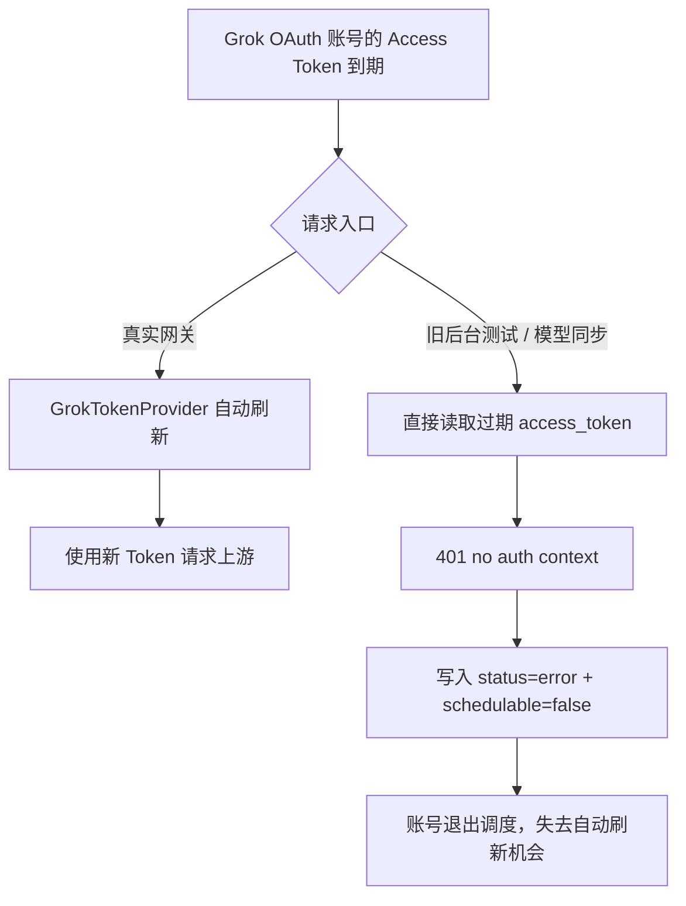

# Grok Free OAuth 账号测试过期 Token 误禁用事故复盘

日期：2026-07-22

修复版本：`v0.1.289`

涉及路径：Grok OAuth / `cli-chat-proxy.grok.com` / 管理端“测试账号” / 上游模型同步

## 1. 摘要

生产中的 Grok Free/Build OAuth 账号会持有短期 Access Token 和可轮换的 Refresh Token。真实网关请求已通过 `GrokTokenProvider` 在 Access Token 到期前自动刷新，但管理端“测试账号”和 Grok 上游模型同步仍直接读取数据库中的 `access_token`。

当 Access Token 已过期时，测试路径会收到：

```text
401 Invalid or expired credentials
reason=no auth context
```

随后通用认证错误逻辑会将账号写成 `status=error` 且 `schedulable=false`。账号被排除出调度后，原本具备自动刷新能力的真实网关路径也不再有机会选中该账号。

`v0.1.289` 将管理端测试、上游模型同步与真实网关统一到同一个 `GrokTokenProvider`，并将该依赖写入 Wire 源图，避免后续重新生成 `wire_gen.go` 时丢失自动刷新能力。

## 2. 影响

- 后台测试可将“Access Token 过期”误判为“OAuth 凭据整体无效”。
- 测试的 401 会永久禁用原本可借助 Refresh Token 自愈的账号。
- 同一账号在真实网关与管理端测试中表现不一致。
- Grok `/models` 同步也可因使用过期 Token 返回 401，造成模型列表与实际凭据能力不一致。
- 上游真实的 402/403 权限或订阅问题与该本地 Bug 混在一起，导致排查方向反复切换到请求头、客户端版本和模式参数。

## 3. 生产证据链

### 3.1 过期 Token 与可刷新凭据

对一个受影响账号进行脱敏检查：

```text
access_token: JWT 结构合法，但 exp 已过期
refresh_token: 存在
scope: 包含 grok-cli:access 与 api:access
```

旧版后台测试直接使用过期 Access Token，稳定复现 401 `no auth context`。

### 3.2 真实刷新后的结果

通过生产现有 OAuth 刷新接口安全刷新同一账号：

```text
refresh: HTTP 200
new access_token: 已持久化
rotated refresh_token: 已持久化
new expires_at: 未过期
```

再次请求 `grok-4.5` 后，401 消失，上游返回真实的 403 `permission-denied`。这证明原 401 来自本地测试链未刷新 Token；刷新后的 403 则是独立的上游权限结果。

### 3.3 Free/Build 库存现状

对当前 Free/Build OAuth 账号池的 JWT 声明进行脱敏统计：

```text
bot_flag_source=1: 全部
refresh_token present: 全部
```

用刷新后的有效 Token 对真实推理接口执行请求指纹矩阵：

| 实现/请求指纹 | 结果 |
| --- | --- |
| CLIProxyAPI 风格 `0.2.93` + workspace UA | 403 |
| grok2api 风格 `0.2.106` + headless + trace 头 | 403 |
| Sub2API `0.2.109` + headless | 403 |
| Sub2API `0.2.109` + interactive | 403 |
| `api.x.ai/v1/responses` | 429，提示减速或升级订阅 |

因此，客户端版本、User-Agent、headless/interactive 或 trace/session 头都不是当前这批账号 403 的根因。

## 4. 参考实现对比

### 4.1 `router-for-me/CLIProxyAPI`

参考提交：`f71ec0eb6776854457892452cf28c47f0d658251`

其 Build 路径使用：

```text
POST https://cli-chat-proxy.grok.com/v1/responses
Authorization: Bearer {access_token}
X-XAI-Token-Auth: xai-grok-cli
x-grok-client-version: 0.2.93
User-Agent: xai-grok-workspace/0.2.93
```

对当前受影响账号的有效 Token 复现后仍返回 403，因此不能将复制该请求头作为恢复 Free Chat 的修复。

### 4.2 `chenyme/grok2api`

参考提交：`4f17dcd6096a59de0ad39df64280ee12814911e1`

该实现明确解析 JWT 中的 `bot_flag_source=1`，并使用以下路由约束：

- Free/Unknown 账号仍走 Build 路径。
- 只有确认为 Super 的账号，遇到 Build 403 或 bot flag 时才可回退 `api.x.ai`。
- Free 账号不允许盲目 API fallback；`headless` 也不是绕过权限的方法。

这与本次生产矩阵一致：向 Free 账号无条件增加 `api.x.ai` fallback 只会把明确的 Build 403 改成 API 429/升级提示，不会恢复可用能力。

## 5. 根因



根因不是 OAuth 刷新能力缺失，而是同一个账号的不同请求入口没有共用已有的 Token Provider。

同时，Wire 存在两个可重现的生成问题：

1. `NewOAuthRefreshAPI` 带可变参数，直接放入 ProviderSet 时 Wire 会尝试解析 `[]time.Duration` 依赖，导致 `go generate ./cmd/server` 失败。
2. Grok Token Provider 对 `OpenAIGatewayService` 的注入只存在于历史 `wire_gen.go` 的手工 setter 调用，没有进入 `wire.go` 的正式依赖图；重新生成时会丢失。

## 6. 修复设计

### 6.1 统一 Token 获取

`AccountTestService` 注入现有 `GrokTokenProvider`：

```go
if account.IsGrokOAuth() && s.grokTokenProvider != nil {
    authToken, err = s.grokTokenProvider.GetAccessToken(ctx, account)
} else {
    authToken = account.GetOpenAIAccessToken()
}
```

该路径在请求上游之前完成：

1. 校验 `expires_at`。
2. 在刷新窗口内使用 Refresh Token。
3. 持久化新 Access Token、新的 `expires_at` 和轮换后的 Refresh Token。
4. 仅使用刷新后的 Token 发送测试。
5. 刷新失败时直接返回已脱敏诊断，不再回退使用过期 Token。

Grok 上游模型同步使用同样的 Provider，避免 `/models` 因本地过期 Token 失败。

### 6.2 固化 Wire 依赖

- 增加无可变参数的 `ProvideOAuthRefreshAPI` 供 Wire 使用。
- `NewAccountTestService` 显式接收 `GrokTokenProvider`。
- `NewOpenAIGatewayService` 显式接收 `GrokTokenProvider`，不再依赖生成文件中的手工 setter。
- 将 `GrokOAuthService.Stop()` 恢复到 `wire.go` 的清理图。
- `go generate ./cmd/server` 可成功运行，且连续生成的 `wire_gen.go` 哈希一致。

## 7. 回归验证

新增回归覆盖：

```text
过期 Grok OAuth Access Token + 有效 Refresh Token
  -> 刷新执行一次
  -> 新 Access/Refresh Token 持久化
  -> 后台测试 Authorization 只使用新 Token
  -> 上游模型同步 Authorization 只使用新 Token
  -> 旧 Token 不会被发送
```

发布前执行：

```bash
cd backend
go generate ./cmd/server
go test ./... -count=1
go test -tags=unit ./internal/service -count=1
go test ./internal/pkg/xai ./internal/service ./internal/handler/admin \
  -run 'Test.*Grok|Test.*OpenAI|Test.*Account|Test.*Usage' -count=1
go vet ./...
go build -o /tmp/sub2api_server ./cmd/server

cd ../frontend
pnpm exec vue-tsc --noEmit --pretty false
```

## 8. 边界与剩余问题

### 已修复

- 过期 Access Token 不再导致后台测试误报 401。
- 管理测试、模型同步和真实网关的 Token 刷新行为对齐。
- 后续 Wire 重新生成不会丢失 Grok Token Provider。

### 未被伪修复的上游限制

- 当前已取证的 Free/Build 库存在刷新后仍由上游返回 403，且 JWT 均含 `bot_flag_source=1`。
- `/models=200` 只证明可读取模型目录，不证明 Chat/Responses endpoint entitlement。
- 调整请求头、客户端版本或模式不能恢复已被上游禁止的 Chat 权限。
- 获取真正可用的 Free 库存需要非 `bot_flag_source=1` 的 Build OAuth 账号，或单独实现 Grok Web SSO/cookie 凭据路径；现有 Build Access/Refresh Token 不能凭空转换为 Web Session。

## 9. 验收不变量

```text
1. 有 Refresh Token 时，过期 Access Token 不得被发送给上游。
2. 后台测试与真实网关必须共用同一 Token Provider。
3. 刷新后仍返回的 402/403 必须保留为真实上游证据。
4. 不得以 /models=200 作为 Chat 可用性证明。
5. Free 账号不得无条件回退 api.x.ai。
6. 重新生成 Wire 不得改变 Grok OAuth 刷新与清理语义。
```
